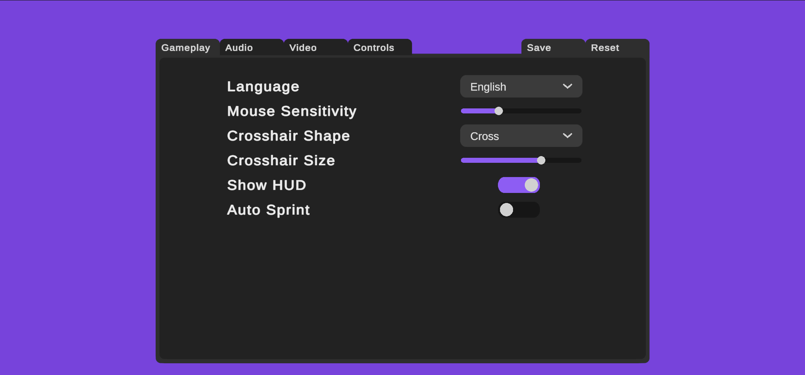
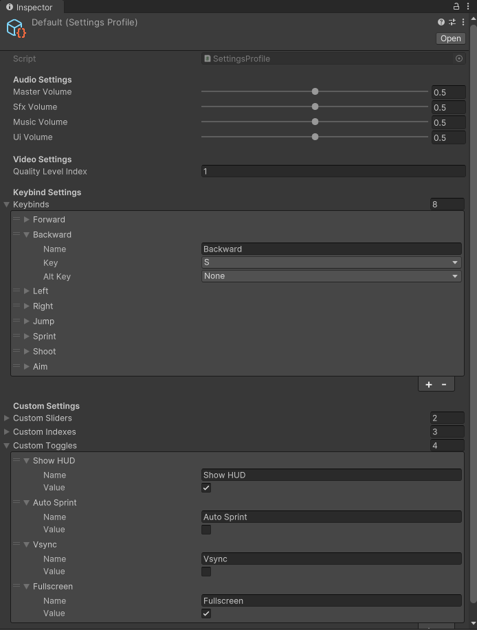
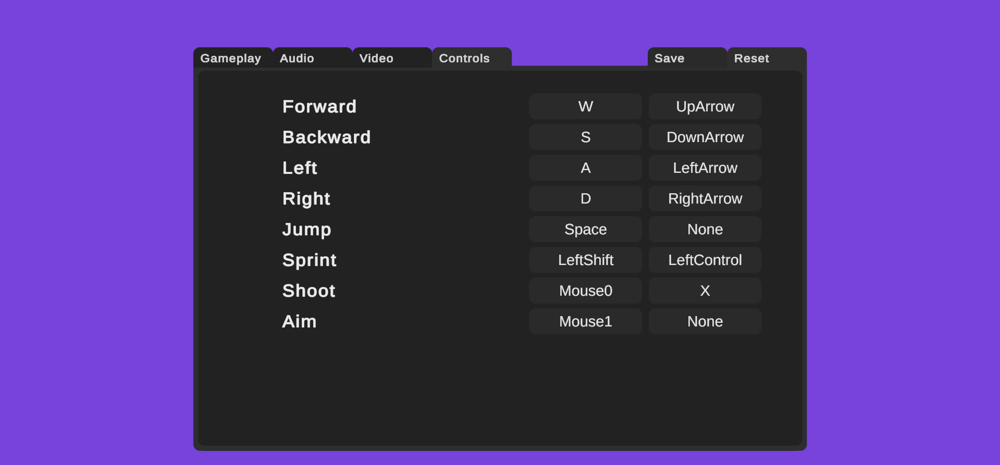

# Unity Modular Settings System

A plug-and-play, data-driven settings framework for Unity built around ScriptableObjects, runtime profiles, and persistent save data.

Supports:
- Audio settings
- Video/quality settings
- Key rebinding
- Custom sliders/indexes/toggles
- Save & load persistence
- Runtime events
- Default profile restoration

Built for Unity 2021 LTS+.

---

## Demo



---

# Features

## Modular Architecture
The system cleanly separates:
- Runtime state
- Save data
- Default values
- UI interaction
- Disk I/O

This keeps gameplay/UI code independent from serialization and file handling.

## Data-Driven Design
Custom settings can be added directly from the inspector without modifying code.

Supported custom types:
- Float sliders
- Integer indexes/dropdowns
- Boolean toggles

## ScriptableObject Profiles
The system uses:
- **Default Profile** → stores default settings
- **Active Profile** → runtime session values



This allows instant restoration of defaults and easy runtime editing.

## Persistent Save System
Settings are automatically saved and loaded using serialized save data.

Current implementation:
- Binary serialization (`BinaryFormatter`)

The system can also be migrated to JSON serialization easily.

## Runtime Events
Built-in events allow UI and gameplay systems to react instantly to changes.

Examples:
- Volume updates
- Quality changes
- Key rebinding
- Full profile reloads

## Keybinding Support
Includes:
- Primary + alternate keybinds
- Runtime rebinding
- Key detection
- Default restoration



---

# System Architecture

```text
┌─────────────────┐     Resources.Load      ┌──────────────────────┐
│  SettingsSystem │ ─────────────────────── │  SettingsProfile     │
│   (static API)  │◄──── events / props ───►│  (ScriptableObject)  │
└────────┬────────┘                         └──────────────────────┘
         │  SaveSettingsData / LoadSettingsData
         ▼
┌─────────────────┐    binary file (.dat)   ┌──────────────────────┐
│   SaveSystem    │ ◄────────────────────── │   SettingsData       │
│  (disk I/O)     │                         │  (serialisable DTO)  │
└─────────────────┘                         └──────────────────────┘
```

---

# Included Scripts

| Script | Responsibility |
|---|---|
| `SaveSystem.cs` | Generic save/load serialization |
| `SettingsData.cs` | Serializable settings snapshot |
| `SettingsProfile.cs` | ScriptableObject settings container |
| `SettingsSystem.cs` | Main public API |

---

# Installation

Copy the scripts into your Unity project:

```text
Assets/
└─ Settings System/
   ├─ Scripts/
   │  ├─ SaveSystem.cs
   │  ├─ SettingsData.cs
   │  ├─ SettingsProfile.cs
   │  └─ SettingsSystem.cs
```

---

# Setup

## 1. Create Settings Profiles

Create two `SettingsProfile` ScriptableObjects:

- `Default`
- `Active`

Place them inside:

```text
Resources/Settings Profiles/
```

Required exact path:
```text
Assets/Resources/Settings Profiles/
```

---

## 2. Configure Defaults

Configure all default values inside the `Default` profile.

The `Active` profile is populated automatically at runtime.

---

# Example Usage

## Audio

```csharp
SettingsSystem.MasterVolume = 0.8f;
SettingsSystem.MusicVolume  = 0.5f;

SettingsSystem.SaveSettingsData();
```

---

## Key Rebinding

```csharp
KeyCode key = await SettingsSystem.DetectKeybind();

SettingsSystem.SetKeybind("Jump", key);

SettingsSystem.SaveSettingsData();
```

---

## Custom Settings

```csharp
SettingsSystem.SetCustomSlider("Brightness", 0.9f);

bool subtitles =
    SettingsSystem.GetCustomToggle("Subtitles");
```

---

# Events

```csharp
void OnEnable()
{
    SettingsSystem.OnMasterVolumeChanged += RefreshAudio;
    SettingsSystem.OnProfileLoaded += RefreshUI;
}

void OnDisable()
{
    SettingsSystem.OnMasterVolumeChanged -= RefreshAudio;
    SettingsSystem.OnProfileLoaded -= RefreshUI;
}
```

---

# Demo Features

The included demo scene showcases:
- Audio sliders
- Quality dropdown
- Runtime key rebinding
- Custom settings
- Save/load functionality
- Undo unsaved changes

---

# Extending the System

## Add Custom Settings
Simply add entries in:
- `customSliders`
- `customIndexes`
- `customToggles`

No additional code required.

## Add New Categories
You can extend the framework with:
- Graphics settings
- Accessibility settings
- Gameplay modifiers
- Input presets
- Localization options

---

# Known Limitations

- `BinaryFormatter` is deprecated in modern .NET
- No encryption layer
- New Input System rebinding must be implemented manually
- WebGL persistence may require a PlayerPrefs fallback

---

# Future Improvements

Planned improvements:
- JSON serialization support
- New Input System implementation
- Save encryption/obfuscation
- WebGL compatibility improvements

---

# License

This project is licensed under the MIT License.

---

# Author

Developed by Belal Saad.
